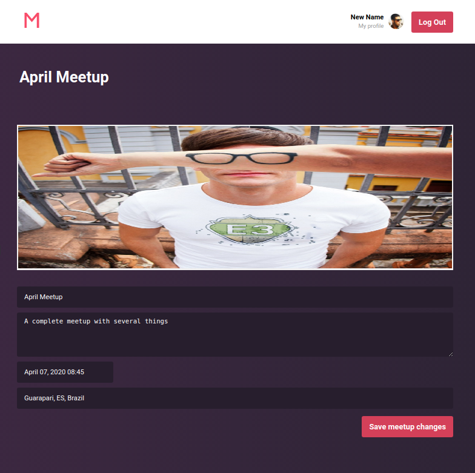

<p align="center">
  

  

  

  

  <a href="https://www.linkedin.com/in/pablosatler/">
    
  </a>

  

</p>

# Meetapp Frontend

> Frontend of the [meetapp backend app](https://github.com/psatler/meetapp-backend)

The frontend web is dedicated for meetup organizers and does not have subscription feature.
So, the organizers can create the meetup and set up its pieces of information, like where it is taking place, banner photo, etc.

This project has ESLint and Prettier configured as its linter and formatting tools respectively along with tools like Redux and Redux Saga, and Reactotron.

---

### Table of Contents

- [How to Run](#how-to-run)

  <!-- - [Features](#features) -->

- [Screens of the app](#screens-of-the-app)

  - [Authentication](#authentication)
  - [Registration](#registration)
  - [Dashboard](#dashboard)
  - [Details](#details)
  - [New / Edit](#new--edit)
  - [Profile](#profile)

- [Some dependecies used](#some-dependecies-used)
- [Acknowledgements](#acknowledgements)
- [License](#license)

### How to Run

First, clone this repository to you local machine. Then, change directory into it
and install the necessary libraries. Next, you can start the application. Below,
the commands are shown using `yarn`, but feel free to run them with `npm` if prefer to.

```
git clone https://github.com/psatler/meetapp-frontend.git

cd meetapp-frontend

yarn (or npm install)

yarn start (or npm start)
```

**PS**: You need to have the [backend app](https://github.com/psatler/meetapp-backend) of
this application running to get the frontend features working correctly.

[Back to top](#meetapp-frontend)

### Screens of the app

#### Authentication

The user will be able to authenticate themselves by email and password.

<!--  -->
<p align="center">
  
</p>

<!--   -->
<p align="center">
  
</p>

[Back to top](#meetapp-frontend)

#### Registration

The user will be able to register themselves in the application using name, e-mail and password.

<!--  -->
<p align="center">
  <!--  -->
  
</p>

[Back to top](#meetapp-frontend)

#### Dashboard

The user can list all the meetup they organize and click on them to see more details about it.

In this screen, the user can navigate to page to create new meetups.

<p align="center">
  <!--  -->
  
</p>

[Back to top](#meetapp-frontend)

#### Details

The user can visualize more details of a given meetup previously registered.

In this screen, they can edit the pieces of information about a meetup or even cancel it.

<p align="center">
  <!--  -->
  
</p>

[Back to top](#meetapp-frontend)

#### New / Edit

The user can register or edit pieces of information about the meetups they organize.

They can preview the banner image of the meetup when they select an image.

All the form fields must be validated.

- New

  <p align="center">
    
  </p>
  <!--  -->

- Edit
  <p align="center">
      <!--  -->
      
    </p>

[Back to top](#meetapp-frontend)

#### Profile

The user can edit its pieces of information registered on the application.

All the form fields must be validated.

<!--  -->
<p align="center">
  
</p>

<p align="center">
  <!--  -->
  
</p>

[Back to top](#meetapp-frontend)

---

### Some dependecies used

- [ESLint](https://github.com/eslint/eslint): A fully pluggable tool for identifying and reporting on patterns in JavaScript
- [Prettier](https://github.com/prettier/prettier): An opinionated code formatter
- [EditorConfig](https://github.com/editorconfig/editorconfig): It helps maintain consistent coding styles for multiple developers working on the same project across various editors and IDEs.
- [Styled Components](https://github.com/styled-components/styled-components): The best bits of ES6 and CSS to style your apps without stress
- [Unform](https://github.com/Rocketseat/unform): Create ReactJS uncontrolled form structures with nested fields, validations and much more!
- [Yup](https://github.com/jquense/yup): Dead simple Object schema validation
- [Axios](https://github.com/axios/axios): Promise based HTTP client for the browser and node.js
- [Typesafe actions](https://github.com/piotrwitek/typesafe-actions): Typesafe utilities designed to reduce types verbosity and complexity in Redux Architecture.
- [Redux persist](https://github.com/rt2zz/redux-persist): To persist the reducers in a local storage
- [React Toastify](https://github.com/fkhadra/react-toastify): To display the toast notifications

[Back to top](#meetapp-frontend)

---

### Acknowledgements

- A good reference to set up ESLint along with Typescript and Prettier can be found at [https://www.robertcooper.me/using-eslint-and-prettier-in-a-typescript-project](https://www.robertcooper.me/using-eslint-and-prettier-in-a-typescript-project)

- CSS speech bubbles made easy at [https://leaverou.github.io/bubbly/](https://leaverou.github.io/bubbly/)

- Adding Redux DevTools to work with Typescript: [https://www.mydatahack.com/getting-redux-devtools-to-work-with-typescript/](https://www.mydatahack.com/getting-redux-devtools-to-work-with-typescript/)

- Fixing some typescript typing errors regarding [JSX element type 'Component' does not have any construct or call signatures. [2604]](https://stackoverflow.com/questions/53452966/typescript-3-jsx-element-type-component-does-not-have-any-construct-or-call-s?rq=1) when creating private routes

- [Adorable Avatars](http://avatars.adorable.io/) is a great source to get images to use as placeholders while crafting the layout of the pages

- A great [React Typescript Cheatsheet](https://github.com/typescript-cheatsheets/react-typescript-cheatsheet) for recipes and use cases of TS with React

- Redux [usage with Typescript](https://redux.js.org/recipes/usage-with-typescript/)

- [Typescript Deep Dive](https://basarat.gitbook.io/typescript/) book

[Back to top](#meetapp-frontend)

---

### License

This project is licensed under the terms of the [MIT License](https://opensource.org/licenses/MIT) © Pablo Satler 2019

---

&nbsp;
